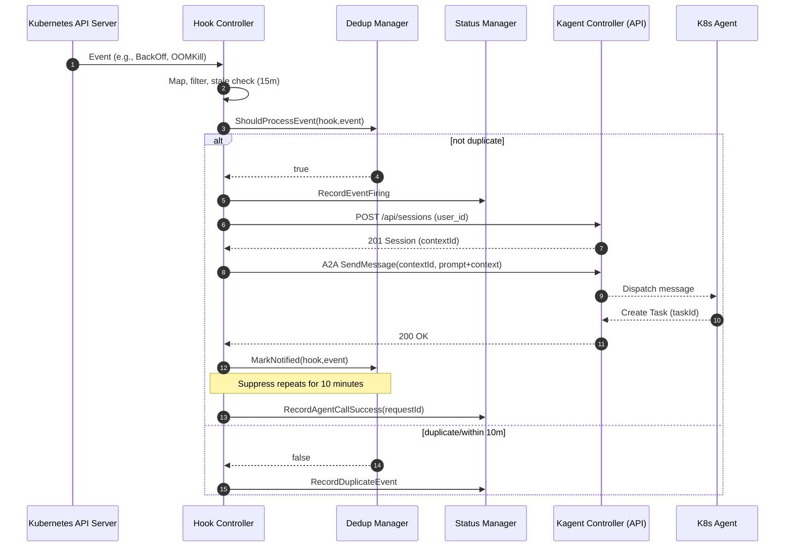

# khook

<p align="center">
  <picture>
    <source media="(prefers-color-scheme: dark)" srcset="https://raw.githubusercontent.com/kagent-dev/khook/refs/heads/main/docs/khook-logo-dark.svg">
    
  </picture>
</p>

A Kubernetes controller that enables automated responses to Kubernetes events by integrating with the [Kagent](https://kagent.dev) platform.

## Overview

The KAgent Hook Controller monitors Kubernetes events and triggers Kagent agents based on configurable hook definitions. It supports multiple event types per hook configuration and implements deduplication logic to prevent duplicate notifications.

### Key Features

- **Multi-Event Monitoring**: Monitor multiple Kubernetes event types (pod-restart, pod-pending, oom-kill, probe-failed) in a single hook configuration
- **Basic Deduplication**: Prevents duplicate notifications with 10-minute timeout logic
- **Kagent Integration**:  Integrates with the Kagent platform for AI agent incident response. (Can in theory talk to any a2a-enabled agent)
- **Status Tracking**: Provides real-time status updates and audit trails through Kubernetes events
- **High Availability**: Supports leader election for production deployments

## Flow: Kubernetes Event to Kagent Task



For how agents respond with either a Message or a Task in A2A, see “Life of a Task” in the A2A protocol docs: https://a2a-protocol.org/latest/topics/life-of-a-task/

## Quick Start

### Prerequisites

- Kubernetes cluster (v1.20+)
- kubectl configured to access your cluster
- [Kagent](https://kagent.dev) installed in cluster or accessible via network.

### Installation

1. **Install via Helm (recommended)**:
   ```bash
   git clone https://github.com/kagent-dev/khook.git
   cd khook
   # Generate Chart.yaml files from templates
   make helm-version
   # Install CRDs first
   helm install khook-crds ./helm/khook-crds \
     --namespace kagent \
     --create-namespace
   # Install controller
   helm install khook ./helm/khook \
     --namespace kagent \
     --create-namespace
   ```

   One-liner (no checkout):
   ```bash
   TMP_DIR="$(mktemp -d)" && \
     git clone --depth 1 https://github.com/kagent-dev/khook.git "$TMP_DIR/khook" && \
     cd "$TMP_DIR/khook" && \
     make helm-version && \
     helm install khook-crds ./helm/khook-crds \
       --namespace kagent \
       --create-namespace && \
     helm install khook ./helm/khook \
       --namespace kagent \
       --create-namespace && \
     cd - && \
     rm -rf "$TMP_DIR"
   ```

   **Alternative using Makefile** (simplest approach):
   ```bash
   git clone https://github.com/kagent-dev/khook.git
   cd khook
   make helm-deploy
   ```

2. **Create Your First Hook**:
   ```yaml
apiVersion: kagent.dev/v1alpha2
kind: Hook
metadata:
  name: basic-pod-monitoring
  namespace: kagent
  labels:
    environment: development
    monitoring-type: basic
spec:
  eventConfigurations:
  # Monitor pod restarts
  - eventType: pod-restart
    agentRef:
      name: k8s-agent
    prompt: |
      AUTONOMOUS MODE: Pod {{.ResourceName}} restarted at {{.EventTime}}. Analyze and fix immediately.
      INSTRUCTIONS:
      • Use all available tools to diagnose and resolve the issue
      • Focus on common issues: crashes, resource limits, health checks, configuration
      • Annotate fixed resources with: kagentFix=<timestamp>
      • If patching fails: delete and recreate resources
      • Never ask for permission - assume autonomous execution
      • Complete remediation without human approval
  # Monitor OOM kills
  - eventType: oom-kill
    agentRef:
      name: k8s-agent
    prompt: |
      AUTONOMOUS MODE: OOM kill for {{.ResourceName}} at {{.EventTime}}. Analyze memory and optimize immediately.
      INSTRUCTIONS:
      • Use all available tools to diagnose and resolve memory issues
      • Focus on memory leaks, inefficient algorithms, large allocations, GC issues
      • Annotate fixed resources with: kagentFix=<timestamp>
      • If patching fails: delete and recreate resources
      • Never ask for permission - assume autonomous execution
      • Complete remediation without human approval
   ```

## Supported Event Types

The controller supports monitoring the following Kubernetes event types:

| Event Type | Description | Common Causes |
|------------|-------------|---------------|
| `pod-restart` | Pod has been restarted | Application crashes, health check failures, resource limits |
| `pod-pending` | Pod is stuck in pending state | Resource constraints, scheduling issues, image pull failures |
| `oom-kill` | Pod was killed due to out-of-memory | Memory limits exceeded, memory leaks |
| `probe-failed` | Liveness or readiness probe failed | Application not responding, configuration issues |

## Future 
The controller will support reacting to additional Kubernetes event.

## Further Future

The controller will support reacting to non-Kubernetes events: task queues, Kafka, webhooks, DB writes, etc.

## Configuration

### Hook Configuration

Each Hook resource defines one or more event configurations:

```yaml
apiVersion: kagent.dev/v1alpha2
kind: Hook
metadata:
  name: example-hook
  namespace: production
spec:
  eventConfigurations:
  - eventType: pod-restart        # Required: Event type to monitor
    agentId: kagent/incident-responder   # Required: Kagent agent ID
    prompt: "Custom prompt..."    # Required: Prompt template for the agent
```

### Controller Configuration

The controller can be configured via environment variables:

| Variable | Description | Default | Required |
|----------|-------------|---------|----------|
| `KAGENT_BASE_URL` | Base URL for Kagent API | `http://kagent-controller.kagent.svc.cluster.local:8083` | Yes |
| `KAGENT_USER_ID` | User identity for A2A requests | `admin@kagent.dev` | Yes |
| `LOG_LEVEL` | Logging level (debug, info, warn, error) | `info` | No |
| `METRICS_PORT` | Port for metrics endpoint | `8080` | No |
| `HEALTH_PORT` | Port for health checks | `8081` | No |
| `LEADER_ELECTION` | Enable leader election | `true` | No |

## Examples

### Basic Pod Monitoring

Monitor pod restarts and OOM kills in the default namespace:

```yaml
apiVersion: kagent.dev/v1alpha2
kind: Hook
metadata:
  name: basic-pod-monitoring
  namespace: default
spec:
  eventConfigurations:
  - eventType: pod-restart
    agentId: pod-restart-analyzer
    prompt: |
      A pod named {{.ResourceName}} has restarted at {{.EventTime}}.
      Please analyze the restart reason and remediate in a fully autonomous matter. Use all available tools. Don't ask for approval.
      
      After analysis - use all available tools to try and resolve. Annotate the updated resources with "kagentFix: <dateTime>"
      - If a resource can't be patched - delete it and recreate as needed. Don't ask for permission. Assume autonomous execution.
      Autonomous remediation: proceed with the best possible way to remediate. Don't ask for approval.
  - eventType: oom-kill
    agentId: memory-optimizer
    prompt: |
      Pod {{.ResourceName}} was killed due to OOM at {{.EventTime}}.
      Please analyze memory usage and resolve in a fully autonomous matter. Use all available tools. Don't ask for approval.
      
      After analysis - use all available tools to try and resolve. Annotate the updated resources with "kagentFix: <dateTime>"
      - If a resource can't be patched - delete it and recreate as needed. Don't ask for permission. Assume autonomous execution.
      Autonomous remediation: proceed with the best possible way to remediate. Don't ask for approval.
```

### Production Monitoring with Multiple Event Types

Comprehensive monitoring for production workloads:

```yaml
apiVersion: kagent.dev/v1alpha2
kind: Hook
metadata:
  name: production-monitoring
  namespace: production
spec:
  eventConfigurations:
  - eventType: pod-restart
    agentId: incident-manager
    prompt: |
      PRODUCTION ALERT: Pod {{.ResourceName}} restarted at {{.EventTime}}.
      Priority: HIGH. Please investigate immediately and provide incident response plan.
      
      After analysis - use all available tools to try and resolve. Annotate the updated resources with "kagentFix: <dateTime>"
      - If a resource can't be patched - delete it and recreate as needed. Don't ask for permission. Assume autonomous execution.
      Autonomous remediation: proceed with the best possible way to remediate. Don't ask for approval.
  - eventType: pod-pending
    agentId: scheduling-analyzer
    prompt: |
      Pod {{.ResourceName}} is pending since {{.EventTime}}.
      Please analyze scheduling constraints and resource availability.
      
      After analysis - use all available tools to try and resolve. Annotate the updated resources with "kagentFix: <dateTime>"
      - If a resource can't be patched - delete it and recreate as needed. Don't ask for permission. Assume autonomous execution.
      Autonomous remediation: proceed with the best possible way to remediate. Don't ask for approval.
  - eventType: probe-failed
    agentId: health-checker
    prompt: |
      Health probe failed for {{.ResourceName}} at {{.EventTime}}.
      Please check application health and configuration.
      
      After analysis - use all available tools to try and resolve. Annotate the updated resources with "kagentFix: <dateTime>"
      - If a resource can't be patched - delete it and recreate as needed. Don't ask for permission. Assume autonomous execution.
      Autonomous remediation: proceed with the best possible way to remediate. Don't ask for approval.
  - eventType: oom-kill
    agentId: capacity-planner
    prompt: |
      CRITICAL: OOM kill for {{.ResourceName}} at {{.EventTime}}.
      Please analyze resource usage and update capacity planning.
      
      After analysis - use all available tools to try and resolve. Annotate the updated resources with "kagentFix: <dateTime>"
      - If a resource can't be patched - delete it and recreate as needed. Don't ask for permission. Assume autonomous execution.
      Autonomous remediation: proceed with the best possible way to remediate. Don't ask for approval.
```

### Development Environment Monitoring

Lightweight monitoring for development environments:

```yaml
apiVersion: kagent.dev/v1alpha2
kind: Hook
metadata:
  name: dev-monitoring
  namespace: development
spec:
  eventConfigurations:
  - eventType: pod-restart
    agentId: dev-helper
    prompt: |
      Dev pod {{.ResourceName}} restarted. 
      Please provide quick debugging tips and common solutions.
      
      After analysis - use all available tools to try and resolve. Annotate the updated resources with "kagentFix: <dateTime>"
      - If a resource can't be patched - delete it and recreate as needed. Don't ask for permission. Assume autonomous execution.
      Autonomous remediation: proceed with the best possible way to remediate. Don't ask for approval.
```

## Kagent API Integration

### Authentication Setup

Current Kagent setup does not require an API key. The controller identifies the caller via a user ID and base URL.

1. Configure via Helm values (recommended):
   - `.Values.kagent.apiUrl` (default: `http://kagent-controller.kagent.svc.cluster.local:8083`)
   - `.Values.kagent.userId` (default: `admin@kagent.dev`)

2. Or set environment variables on the Deployment:
   ```bash
   kubectl set env -n kagent deploy/khook \
     KAGENT_API_URL=http://kagent-controller.kagent.svc.cluster.local:8083 \
     KAGENT_USER_ID=admin@kagent.dev
   ```

### API Request Format

When events occur, the controller sends requests to the Kagent API:

```json
{
  "agentId": "kagent/incident-responder",
  "prompt": "A pod has restarted. Please analyze...",
  "context": {
    "eventName": "pod-restart",
    "eventTime": "2024-01-15T10:30:00Z",
    "resourceName": "my-app-pod-123",
    "namespace": "production",
    "eventMessage": "Container my-app in pod my-app-pod-123 restarted"
  }
}
```

### Error Handling and Retries

The controller implements robust error handling:

- **Exponential Backoff**: Failed API calls are retried with exponential backoff (max 3 attempts)
- **Circuit Breaker**: Prevents cascading failures during Kagent API outages
- **Status Updates**: Hook status reflects API call success/failure states
- **Audit Trail**: All API interactions are logged and emit Kubernetes events

## Monitoring and Observability

### Status Monitoring

Check hook status to see active events:

```bash
kubectl get hooks -o wide
kubectl describe hook my-hook
```

Example status output:
```yaml
status:
  activeEvents:
  - eventType: pod-restart
    resourceName: my-app-pod-123
    firstSeen: "2024-01-15T10:30:00Z"
    lastSeen: "2024-01-15T10:30:00Z"
    status: firing
  lastUpdated: "2024-01-15T10:30:05Z"
```

### Kubernetes Events

The controller emits Kubernetes events for audit trails:

```bash
kubectl get events --field-selector involvedObject.kind=Hook
```

### Metrics

The controller exposes Prometheus metrics on port 8080:

- `khook_events_total`: Total number of events processed
- `khook_api_calls_total`: Total number of Kagent API calls
- `khook_api_call_duration_seconds`: API call duration histogram
- `khook_active_events`: Number of currently active events

### Health Checks

Health check endpoints are available on port 8081:

- `/healthz`: Liveness probe
- `/readyz`: Readiness probe

## Troubleshooting

### Common Issues

#### Hook Not Processing Events

**Symptoms**: Hook is created but events are not being processed.

**Possible Causes**:
1. Controller not running or not watching the namespace
2. RBAC permissions missing
3. Event types not matching actual Kubernetes events

**Solutions**:
```bash
# Check controller logs
kubectl logs -n kagent deployment/khook

# Verify RBAC permissions
kubectl auth can-i get events --as=system:serviceaccount:kagent:khook

# Check hook status
kubectl describe hook your-hook-name
```

#### Kagent API Connection Failures

**Symptoms**: Events are detected but Kagent API calls fail.

**Possible Causes**:
1. Invalid API credentials
2. Network connectivity issues
3. Kagent API endpoint unreachable

**Solutions**:
```bash
# Verify credentials
kubectl get secret kagent-credentials -o yaml

# Test API connectivity from controller pod
kubectl exec -n kagent deployment/khook -- \
  curl -H "Authorization: Bearer $KAGENT_API_KEY" $KAGENT_BASE_URL/health

# Check controller logs for API errors
kubectl logs -n kagent deployment/khook | grep "kagent-api"
```

#### Events Not Being Deduplicated

**Symptoms**: Same event triggers multiple Kagent calls within 10 minutes.

**Possible Causes**:
1. Controller restarts causing memory loss
2. Multiple controller instances without leader election
3. Clock skew issues

**Solutions**:
```bash
# Check controller restart count
kubectl get pods -n kagent

# Verify leader election is working
kubectl logs -n kagent deployment/khook | grep "leader"

# Check system time synchronization
kubectl exec -n kagent deployment/khook -- date
```

#### High Memory Usage

**Symptoms**: Controller pod consuming excessive memory.

**Possible Causes**:
1. Large number of active events not being cleaned up
2. Memory leak in event processing
3. Insufficient resource limits

**Solutions**:
```bash
# Check active events across all hooks
kubectl get hooks -A -o jsonpath='{range .items[*]}{.metadata.name}: {.status.activeEvents}{"\n"}{end}'

# Monitor memory usage
kubectl top pod -n kagent

# Adjust resource limits
kubectl patch deployment -n kagent khook -p '{"spec":{"template":{"spec":{"containers":[{"name":"manager","resources":{"limits":{"memory":"512Mi"}}}]}}}}'
```

### Debug Mode

Enable debug logging for detailed troubleshooting:

```bash
kubectl set env deployment/khook -n kagent LOG_LEVEL=debug
```

### Support

For additional support:

1. Check the [GitHub Issues](https://github.com/kagent-dev/khook/issues)
2. Review the [troubleshooting guide](docs/troubleshooting.md)
3. Join the [Kagent community](https://community.kagent.dev)

## Development

### Prerequisites

- Go 1.21+
- Kubernetes cluster (kind/minikube for local development)
- kubectl configured
- Docker (for building images)

### Local Development Setup

1. **Clone the repository**:
   ```bash
   git clone https://github.com/kagent-dev/khook.git
   cd khook
   ```

2. **Install dependencies**:
   ```bash
   go mod download
   ```

3. **Run tests**:
   ```bash
   make test
   ```

4. **Build the binary**:
   ```bash
   make build
   ```

5. **Run locally** (requires kubeconfig):
   ```bash
   export KAGENT_API_KEY=your-test-key
   export KAGENT_BASE_URL=https://test.kagent.dev
   make run
   ```

### Project Structure

```
├── api/v1alpha2/               # API types and CRD definitions
├── cmd/                        # Main application entry point
├── config/                     # Kubernetes manifests and configuration
│   ├── crd/                    # Custom Resource Definitions
│   ├── rbac/                   # RBAC configurations
│   └── manager/                # Controller deployment manifests
├── docs/                       # Additional documentation
├── examples/                   # Example Hook configurations
├── internal/
│   ├── client/                 # Kagent API client implementation
│   ├── config/                 # Configuration management
│   ├── controller/             # Kubernetes controller logic
│   ├── deduplication/          # Event deduplication logic
│   ├── event/                  # Event watching and filtering
│   ├── interfaces/             # Core interfaces
│   ├── logging/                # Logging utilities
│   ├── pipeline/               # Event processing pipeline
│   └── status/                 # Status management
├── Makefile                    # Build and deployment targets
└── go.mod                      # Go module definition
```

### Building and Testing

```bash
# Run all tests
make test

# Run integration tests (requires cluster)
make test-integration

# Build binary
make build

# Build Docker image
make docker-build

# Deploy to cluster
make deploy

# Clean up
make undeploy
```

## API Reference

See [API Reference](docs/api-reference.md) for detailed documentation of the Hook CRD schema and status fields.

## Contributing

We welcome contributions! Please see [CONTRIBUTING.md](CONTRIBUTING.md) for guidelines.

## License

This project is licensed under the Apache License 2.0 - see the [LICENSE](LICENSE) file for details.

### License Summary
- ✅ **Free Use**: You can use this software for any purpose
- ✅ **Free Extension & Editing**: You can modify and extend the code
- ✅ **Patent Protection**: The license includes explicit patent protection clauses
- ⚠️ **Commercial Redistribution**: Commercial redistribution is allowed but must comply with Apache 2.0 terms

### What This Means
- **Personal Use**: Completely free - use it for any personal projects
- **Open Source Development**: Modify and share your changes freely
- **Commercial Use**: You can use it commercially, but any redistributions must include the full license text
- **Patent Protection**: Contributors provide patent grants for their contributions

For the complete license text and full terms, see the [LICENSE](LICENSE) file.
